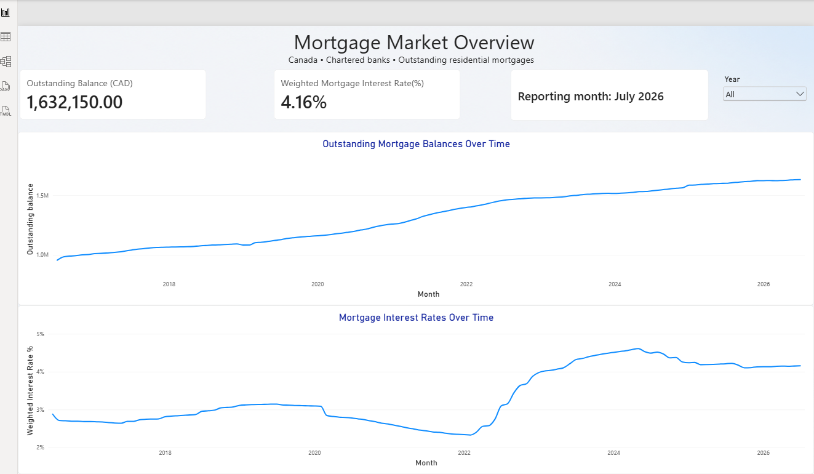

# Project Summary

This project analyses outstanding residential mortgage balances and interest rates reported for Canadian chartered banks using Statistics Canada Table 10-10-0006-01.

The Power BI report contains two pages:

-   **Mortgage Market Overview:** outstanding mortgage balances and balance-weighted interest-rate trends.
-   **Mortgage Type Comparison:** fixed and variable mortgage rates and their difference in percentage points.

Year slicers support historical exploration. Summary cards show the latest available month within the selected year, identified by a reporting-month indicator.

The project combines Power Query data preparation, a Calendar table, DAX calculations, and interactive visualisations to explore mortgage balance and borrowing-rate trends.

\newpage
# Business Question and Objectives

## Main Business Question

How have outstanding residential mortgage balances and balance-weighted interest rates evolved for Canadian chartered banks in aggregate, and what does the changing fixed–variable rate gap reveal about borrowing-rate trends?

## Objectives

-   Examine changes in outstanding mortgage balances.
-   Track balance-weighted interest rates over time.
-   Compare fixed and variable mortgage rates.
-   Calculate the variable-minus-fixed rate gap in percentage points.
-   Enable exploration by year and identify the reporting month.

## Analytical Scope

The report describes aggregate mortgage balances and rates. It does not directly measure borrower affordability, arrears, default probability, or individual banks' financial risk.

# Data Source and Scope

## Data Source

The analysis uses Statistics Canada Table 10-10-0006-01, *Funds advanced, outstanding balances, and interest rates for new and existing lending, Bank of Canada*.

The table publishes monthly Canadian lending statistics sourced from the Bank of Canada. The data was imported into Power BI from a downloaded CSV file.

Source: <https://doi.org/10.25318/1010000601-eng>

## Coverage of This Report

The dashboard focuses on outstanding residential mortgages reported for Canadian chartered banks in aggregate. It covers insured and uninsured mortgages and compares fixed and variable interest-rate categories.

The project data covers July 2016 to July 2026 for the outstanding mortgage series used in the dashboard. This is the coverage of the downloaded dataset, rather than a claim about the latest data available from the publisher.

The report analyses outstanding balances and their associated rates. Funds advanced for new lending are outside the scope of the dashboard.

## Units and Interpretation

| Item                          | Unit or meaning              |
|-------------------------------|------------------------------|
| Outstanding balance           | Millions of Canadian dollars |
| Interest rate                 | Percent                      |
| Variable-minus-fixed rate gap | Percentage points            |
| REF_DATE                      | Monthly reference period     |

An outstanding balance is a stock measured at a point in time. Monthly balances are therefore plotted over time, rather than added together to represent an annual total.

Summary cards display the latest available month within the selected year. When all years are selected, they display the latest available month in the project dataset.

## Scope Boundaries

These aggregate figures do not support comparisons between individual banks or provinces. They also do not represent every mortgage lender operating in Canada.

Rates associated with outstanding mortgages describe existing lending. They should not be interpreted as current advertised rates or offers available to new borrowers.

The dataset does not directly establish borrower affordability, mortgage arrears, default probability, or the causes of observed changes.

# Data Preparation and Transformation

Power Query was used to prepare the Statistics Canada CSV for analysis. The transformations retain the original source fields and add categories and numeric columns used by the dashboard.

## Import and Data Types

The CSV was imported using UTF-8 encoding, and the first row was promoted to column headers.

`REF_DATE` was converted to a date, `VALUE` to a numeric field, and descriptive fields to text. The derived balance and interest-rate columns were assigned numeric and percentage types respectively.

## Residential Mortgage Selection

Rows were retained when `Components` contained “residential mortgages,” with an additional condition excluding “non-residential mortgages.”

Both funds advanced and outstanding balances remain in the prepared table. The dashboard measures select outstanding balances for the analysis presented in this report.

## Mortgage Categories

Four descriptive columns were derived from `Components`:

| Column           | Classification                                                                           |
|----------------|--------------------------------------------------------|
| Insurance status | Insured or Uninsured                                                                     |
| Rate type        | Fixed, Variable, or Total                                                                |
| Lending measure  | Funds Advanced or Outstanding Balance                                                    |
| Mortgage term    | Less than 1 year, 1–\<3 years, 3–\<5 years, 5 years or more, Variable rate, or All terms |

The insurance classification checks for “uninsured” before “insured” because the word “uninsured” also contains “insured.”

Records that do not match the classification rules receive an “Unknown” label, allowing them to be identified during validation.

## Balance and Interest-Rate Columns

Two columns separate the numeric observations by their unit:

-   **Amount in CAD millions:** retains `VALUE` for rows where `UOM` is “Dollars.” The source expresses these balances in millions, so no additional division is applied.
-   **Interest Rate Column:** retains `VALUE / 100` for rows where `UOM` is “Percent.” For example, a source value of 4.39 becomes 0.0439 and displays as 4.39% in Power BI.

Other rows receive null values in the corresponding derived column. These nulls are intentional: a balance observation and an interest-rate observation are stored on separate source rows.

## Preparation for Weighted Calculations

The original `Components` field was retained so that DAX measures can match balances and rates within the same mortgage category.

Separating the units supports balance-weighted interest-rate calculations, where categories with larger outstanding balances contribute more to the result.

# Data Model

## Model Structure

The Power BI model contains two tables:

| Table          | Purpose                                                                                             |
|---------------|---------------------------------------------------------|
| MortgageMarket | Stores the monthly mortgage observations and categories prepared in Power Query.                    |
| Calendar       | Provides Date, Month, Month Number, Year, and Year Month fields for organizing time-based analysis. |

Each mortgage observation represents a reporting month, mortgage category, and unit of measure. Multiple observations therefore share the same reporting date.

## Date Relationship

An active many-to-one (\*:1) relationship connects `MortgageMarket[REF_DATE]` to `Calendar[Date]`.

The Calendar table is the “one” side, while MortgageMarket is the “many” side. Single-direction filtering allows selections from Calendar to filter the related mortgage observations.

This relationship supports year selections and consistent date filtering across the report.

## Measures and Filter Context

DAX measures calculate outstanding balances, balance-weighted mortgage interest rates, the variable-minus-fixed rate gap, and the reporting month.

The measures respond to the applicable report filters. Summary cards use the latest available reporting month within the selected period, while line charts display changes over time.

# DAX Measures and Calculation Logic

## Outstanding Mortgage Balance

The `Outstanding Balance CAD Millions` measure reports the outstanding residential mortgage balance in CAD millions.

``` dax
Outstanding Balance CAD Millions =
VAR LatestMonth =
    MAX('MortgageMarket'[REF_DATE])
RETURN
    CALCULATE(
        SUM('MortgageMarket'[Amount in CAD Millions]),
        'MortgageMarket'[Lending Measure ] = "Outstanding Balance",
        'MortgageMarket'[Rate Type ] = "Total",
        'MortgageMarket'[REF_DATE] = LatestMonth
    )
```

The calculation:

-   Identifies the latest reporting date within the current filter context.
-   Selects outstanding balances and the Total rate category.
-   Sums the balance observations for that month.

Using the Total category prevents double counting across total, fixed, and variable categories.

On a summary card, selecting a year returns its latest available month rather than adding monthly balances together. On a monthly line chart, each point represents that month’s outstanding balance.

The result remains in CAD millions, matching the source units. \## Balance-Weighted Mortgage Interest Rate

The `Outstanding Mortgage Interest Rate` measure combines the rates for insured and uninsured outstanding mortgages, weighted by their respective balances.

``` dax
Outstanding Mortgage Interest Rate =
VAR LatestMonth =
    MAX('MortgageMarket'[REF_DATE])
VAR MortgageRows =
    CALCULATETABLE(
        'MortgageMarket',
        'MortgageMarket'[REF_DATE] = LatestMonth,
        'MortgageMarket'[Lending Measure ] = "Outstanding Balance",
        'MortgageMarket'[Rate Type ] = "Total"
    )
VAR Groups =
    GROUPBY(
        MortgageRows,
        'MortgageMarket'[Insuarance status ],
        "Balance",
            SUMX(
                CURRENTGROUP(),
                'MortgageMarket'[Amount in CAD millions]
            ),
        "Rate",
            MAXX(
                CURRENTGROUP(),
                'MortgageMarket'[Interest Rate Column ]
            )
    )
VAR MissingValues =
    COUNTROWS(
        FILTER(
            Groups,
            ISBLANK([Balance]) || ISBLANK([Rate])
        )
    )
RETURN
    IF(
        MissingValues > 0,
        BLANK(),
        DIVIDE(
            SUMX(Groups, [Balance] * [Rate]),
            SUMX(Groups, [Balance])
        )
    )
```

### Calculation Logic

The measure selects the latest reporting month within the current filter context and retains the Total category for outstanding balances.

It groups the observations by insurance status, pairing each group’s balance with its interest rate. The weighted rate is calculated as:

$$
\text{Weighted rate}
=
\frac{\sum_g B_g r_g}{\sum_g B_g}
$$

Here, (B_g) is the outstanding balance and (r_g) is the interest rate for insurance group (g).

This approach accounts for differences in mortgage balances between groups. A simple average would give each group equal influence regardless of its balance.

### Missing Values and Validation

The measure returns blank if a group present in the selected data has a missing balance or rate. `DIVIDE` also returns blank when the denominator is zero.

The calculation assumes one valid rate observation per insurance group and month. Validation must check for duplicate rate observations and entirely absent groups, because the measure does not explicitly detect these conditions.

The result is stored as a decimal and displayed as a percentage.

## Mortgage Interest Rate by Type

The `Mortgage Rate by Type` measure calculates balance-weighted interest rates for fixed and variable outstanding mortgages.

``` dax
Mortgage Rate by Type =
VAR LatestMonth =
    MAX('MortgageMarket'[REF_DATE])
VAR MortgageRows =
    CALCULATETABLE(
        'MortgageMarket',
        'MortgageMarket'[REF_DATE] = LatestMonth,
        'MortgageMarket'[Lending Measure ] = "Outstanding Balance",
        KEEPFILTERS(
            'MortgageMarket'[Rate Type ] IN {"Fixed", "Variable"}
        )
    )
VAR Groups =
    GROUPBY(
        MortgageRows,
        'MortgageMarket'[Components],
        "Balance",
            SUMX(
                CURRENTGROUP(),
                IF(
                    'MortgageMarket'[UOM] = "Dollars",
                    'MortgageMarket'[VALUE]
                )
            ),
        "Rate",
            MAXX(
                CURRENTGROUP(),
                IF(
                    'MortgageMarket'[UOM] = "Percent",
                    'MortgageMarket'[VALUE] / 100
                )
            )
    )
VAR MissingValues =
    COUNTROWS(
        FILTER(
            Groups,
            ISBLANK([Balance]) ||
            ISBLANK([Rate]) ||
            [Balance] <= 0
        )
    )
RETURN
    IF(
        COUNTROWS(Groups) = 0 || MissingValues > 0,
        BLANK(),
        DIVIDE(
            SUMX(Groups, [Balance] * [Rate]),
            SUMX(Groups, [Balance])
        )
    )
```

### Calculation Logic

The measure selects the latest reporting month in the current filter context and restricts the calculation to Fixed and Variable categories.

`KEEPFILTERS` preserves the existing rate-type selection. A Fixed-filtered card therefore calculates the fixed rate, while a Variable-filtered card calculates the variable rate. In the comparison chart, the Rate Type legend creates a separate calculation for each series.

The measure groups observations by `Components`, which identifies the mortgage type, insurance status, and applicable term category. Within each group, it extracts:

-   The balance from the Dollars observation.
-   The interest rate from the Percent observation, divided by 100.

It then calculates the weighted rate as the sum of balance multiplied by rate, divided by the sum of balances. This gives larger mortgage categories greater influence and excludes the Total category to avoid double counting.

Without a filter separating Fixed and Variable, the measure calculates a combined weighted rate across both types.

### Missing Values and Validation

The measure returns blank when no groups are available or when a group present in the data has a missing rate, missing balance, or non-positive balance.

Validation must also check for duplicate observations and entirely absent categories. The calculation assumes one balance and one rate observation per component and reporting month.

The result is displayed as a percentage.

## Variable–Fixed Rate Gap

The gap subtracts the balance-weighted fixed mortgage rate from the balance-weighted variable mortgage rate and expresses the difference in percentage points.

-   A negative gap means the variable rate is lower.
-   A positive gap means the variable rate is higher.
-   A zero gap means the rates are equal.

For illustration, a variable rate of 3.74% and a fixed rate of 4.39% produce a gap of −0.65 percentage points.

The measure returns blank if either rate is unavailable. This comparison describes rates on outstanding mortgage balances; it does not establish which mortgage type would be better for an individual borrower.

## Reporting Month

The Reporting Month measure displays the latest reporting month for outstanding balances within the current date selection.

It removes filters from the Rate Type column so that selecting Fixed or Variable does not change the reporting label. Date filters remain in effect.

The label displays “Reporting month: Month Year,” or “No data” when no matching reporting date is available.

\newpage
# Dashboard Design and Functionality

## Mortgage Market Overview

The overview page presents the size of outstanding residential mortgage balances and their balance-weighted interest rate for Canadian chartered banks.

It includes:

-   An outstanding balance card, expressed in CAD millions.
-   A balance-weighted mortgage interest-rate card.
-   A reporting-month label identifying the period represented by the cards.
-   Monthly line charts showing outstanding balances and weighted interest rates.
-   A Year slicer for exploring a selected period.

The cards display the latest available month within the date selection. The charts show monthly observations throughout that selection.



\newpage
## Mortgage Type Comparison

The comparison page examines differences between fixed and variable mortgage interest rates.

It includes:

-   Separate balance-weighted fixed and variable rate cards.
-   A Variable − Fixed gap card, expressed in percentage points.
-   A reporting-month label.
-   A monthly line chart comparing both rate types.
-   Year and Rate Type slicers.

The Year slicer controls the reporting period. The Rate Type slicer controls which series appears in the chart, while the comparison cards remain visible and unchanged.


\newpage

## Reading the Dashboard

The reporting-month label provides context for the summary values. Chart tooltips display the values for the month being hovered over, which may differ from the month represented by the cards.

A positive rate gap means the variable rate exceeds the fixed rate; a negative gap means it is lower. The gap describes the difference between weighted rates on outstanding mortgage balances.

# Validation and Quality Checks

## Dashboard Behaviour

The dashboard was tested using a 2024 year selection.

| Check                       | Observed result                    |
|-----------------------------|------------------------------------|
| Overview reporting month    | December 2024                      |
| Outstanding balance card    | 1,563,705.00 CAD millions          |
| Weighted interest-rate card | 4.26%                              |
| Overview charts             | Displayed the selected 2024 period |
| Fixed rate card             | 4.10%                              |
| Variable rate card          | 4.69%                              |
| Variable − Fixed gap        | 0.59 percentage points             |

The displayed gap is consistent with the rounded card values: 4.69% − 4.10% = 0.59 percentage points. The measure itself uses unrounded rates before formatting.

## Slicer Interactions

Fixed and Variable selections were tested separately on the comparison page.

Each selection displayed only the corresponding chart series. The fixed rate, variable rate, gap, and reporting-month cards remained unchanged, preserving the comparison context.

## Calculation Review

The DAX review confirmed that:

-   Outstanding balances are selected for a reporting month rather than summed across months.
-   The balance measure uses the Total rate category to avoid combining totals with their components.
-   Interest rates are weighted by the corresponding outstanding balances.
-   Source percentage values are divided by 100 before percentage formatting.
-   The rate gap is expressed in percentage points.
-   Rate measures return blank under the missing-value conditions defined in their formulas.

## Remaining Source-Data Checks

The screenshot checks establish visual behaviour and internal consistency. Independent reconciliation with the source CSV remains necessary to confirm numerical accuracy.

The remaining checks are:

-   Recalculate the displayed balances and weighted rates from the source observations.
-   Check for duplicate observations within each reporting month, component, and unit.
-   Check that all expected balance and rate pairs are present.
-   Review any “Unknown” classifications.
-   Confirm that clearing the Year selection returns the latest available reporting month.

## Independent Source Reconciliation

The dashboard calculations were independently reproduced from the imported CSV, matching balances and rates by reporting month and mortgage component.

| December 2024 metric               | Independently calculated | Dashboard display |
|-------------------------------|----------------------:|-----------------:|
| Outstanding balance (CAD millions) |             1,563,705.00 |      1,563,705.00 |
| Weighted overall rate              |                  4.2615% |             4.26% |
| Weighted fixed rate                |                  4.1016% |             4.10% |
| Weighted variable rate             |                  4.6885% |             4.69% |
| Variable − Fixed gap               |                0.5869 pp |           0.59 pp |

All five results agree at the dashboard’s displayed precision.

## Source Completeness and Classification

For outstanding residential mortgages from July 2016 through July 2026:

-   All 121 reporting months contain the expected 12 mortgage components.
-   All 1,452 component-month groups contain both a balance and an interest rate.
-   No duplicate reporting-month, component, and unit keys were found.
-   No non-positive balances were found.

Applying the documented classification rules to the residential mortgage records produced no Unknown insurance, rate-type, lending-measure, or mortgage-term categories.

The CSV contains earlier outstanding-mortgage rows with missing observations. July 2016 is the first populated month, supporting the dashboard’s analytical start date.

The source confirms that balance observations are expressed in CAD millions. \# Key Findings and Business Interpretation

## Outstanding Balances Increased During 2024

Outstanding residential mortgage balances increased from CAD 1.516 trillion in January 2024 to CAD 1.564 trillion in December 2024.

This represents an increase of approximately CAD 47.9 billion, or 3.2%, between those monthly observations.

The result shows growth in the outstanding mortgage stock. It does not measure new lending alone, because outstanding balances also reflect repayments and other changes.

## Fixed and Variable Rates Moved in Different Directions

Between January and December 2024:

| Metric                 | January 2024 | December 2024 |
|------------------------|-------------:|--------------:|
| Weighted fixed rate    |        3.68% |         4.10% |
| Weighted variable rate |        6.62% |         4.69% |
| Variable − Fixed gap   |     +2.94 pp |      +0.59 pp |

The variable rate declined by approximately 1.93 percentage points, while the fixed rate increased by approximately 0.42 percentage points.

Consequently, the gap narrowed by approximately 2.35 percentage points. Variable rates remained higher at year-end, but the difference was substantially smaller.

This demonstrates why an overall mortgage rate alone is insufficient to describe movements within the market.

## Balance Growth Continued as the Overall Rate Declined

From December 2024 to July 2026, outstanding balances increased from CAD 1.564 trillion to CAD 1.632 trillion. Over the same interval, the weighted overall interest rate declined from 4.26% to 4.16%.

Balance growth and a declining average rate can occur together. The dashboard therefore tracks both the size of outstanding lending and its weighted rate rather than treating either metric as a complete measure of market conditions.

These observations do not establish changes in borrower affordability, bank profitability, or credit losses.

## The Fixed–Variable Gap Reversed Sign

By July 2026, the weighted fixed rate was 4.39% and the weighted variable rate was 3.74%, producing a gap of −0.65 percentage points.

This contrasts with the +0.59 percentage-point gap in December 2024. The relative rate ordering had reversed: the variable rate was lower in the later observation.

The comparison describes rates on outstanding mortgage balances. It does not compare new mortgage offers or establish which mortgage type an individual should choose.

## Business Relevance

The two dashboard pages support monitoring of mortgage balance growth, weighted interest-rate trends, and differences between fixed and variable lending.

For a banking analyst, the findings identify questions for further investigation: which mortgage categories contribute to balance growth, how the portfolio composition changes, and how rates differ across those categories.

Answering questions about repayment stress or credit risk would require additional information, including arrears, borrower income, loan-to-value ratios, and renewal schedules.

# Limitations and Future Improvements

## Limitations

The analysis covers Canadian chartered banks in aggregate. It does not identify differences between individual banks, provinces, or borrowers.

The rates describe outstanding mortgage balances rather than advertised offers for new mortgages. Changes in weighted rates can reflect changes in both category rates and the composition of outstanding balances.

The dataset does not contain borrower income, payment amounts, arrears, credit scores, or loan-to-value ratios. The dashboard therefore describes balance and rate trends without directly measuring affordability or default risk.

The report uses a downloaded data snapshot ending in July 2026. Future releases and revisions may change the results.

## Adding Related Datasets

A future version could incorporate additional datasets to extend the business questions answered by the dashboard.

| Additional dataset                           | Analytical purpose                                                                |
|--------------------------|----------------------------------------------|
| Bank of Canada policy rate                   | Compare policy-rate movements with changes in outstanding mortgage rates.         |
| Mortgage arrears statistics                  | Examine whether changes in rates coincide with changes in repayment difficulties. |
| Household income and debt-service indicators | Add context about households’ capacity to service debt.                           |
| Housing price indicators                     | Compare mortgage balance growth with housing-market trends.                       |

These comparisons would provide additional context. They would not, by themselves, establish that one variable caused changes in another.

## Integration Approach

Additional datasets should be stored in separate fact tables connected to a shared Calendar table. This would preserve each dataset’s original level of detail and avoid duplicating mortgage observations through direct joins.

Before integration, the datasets would need to be checked for compatible definitions, geographic coverage, reporting frequency, units, and date ranges.

Monthly and quarterly series would require an explicit period-alignment approach. Missing observations should remain identifiable rather than being treated as zero.

## Further Dashboard Improvements

Future development could include mortgage balance shares by rate type and insurance status, changes between reporting periods, and additional data-quality checks.

A repeatable refresh process could update the analysis when a new source file becomes available.
\newpage

# Conclusion

This project transformed monthly mortgage statistics into a two-page Power BI report examining outstanding residential mortgage balances and balance-weighted interest rates for Canadian chartered banks.

The analysis found that balances increased during 2024 while fixed and variable rates moved in different directions, narrowing their rate gap. By July 2026, the variable rate was below the fixed rate, reversing the ordering observed in December 2024.

Power Query supported data preparation, a Calendar relationship enabled date filtering, and DAX measures calculated monthly balances, weighted rates, and percentage-point differences. Independent CSV calculations matched all five December 2024 dashboard values at their displayed precision.

The dashboard provides a foundation for monitoring mortgage-market trends. Additional datasets would be needed to investigate borrower affordability, repayment difficulties, or credit risk.

\newpage

# References

Statistics Canada. (n.d.). *Funds advanced, outstanding balances, and interest rates for new and existing lending, Bank of Canada* (Table 10-10-0006-01) \[Data table\].

<https://doi.org/10.25318/1010000601-eng>

Bank of Canada. (n.d.). *Interest rates charged for new and existing lending by chartered banks* \[Data and methodological notes\].

<https://www.bankofcanada.ca/rates/banking-and-financial-statistics/interest-rates-for-new-and-existing-lending-by-chartered-banks/>

Microsoft Corporation. (n.d.). *Microsoft Power BI Desktop* \[Software\].

<https://www.microsoft.com/en-us/power-platform/products/power-bi/desktop>

## Data and Calculation Attribution

The analysis uses a downloaded CSV from Statistics Canada Table 10-10-0006-01. The analytical period covers populated outstanding residential mortgage observations from July 2016 through July 2026.

The Bank of Canada provides context on the underlying lending statistics and interest-rate methodology. Power BI Desktop was used for Power Query transformations, data modelling, DAX calculations, and report design.

The dashboard’s derived measures, independent CSV reconciliation, and analytical interpretations are the author’s work.

\newpage

# Technical Appendix

## Power Query Transformation Code

## Calendar Table Definition

## DAX Measures

### Outstanding Balance CAD Millions

### Outstanding Mortgage Interest Rate

### Mortgage Rate by Type

### Variable Minus Fixed Rate Gap

### Reporting Month
